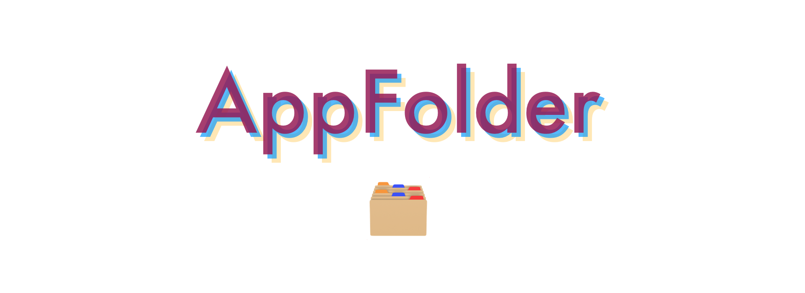

# AppFolder

[![Swift][swift-badge]][swift-url]
[![Platform][platform-badge]][platform-url]
[](https://travis-ci.org/dreymonde/AppFolder)

**AppFolder** is a lightweight framework that lets you design a friendly, strongly-typed representation of a directories inside your app folder. All the system directories like **"Caches/"** and 
**"Application Support/"** are already present, and you can add yours using just a few lines of code.

**AppFolder** has a simple and beautiful interface which was made possible with the help of **Swift**'s dark magic: _inheritance_ 😱

## Usage

```swift
import AppFolder

let documents = AppFolder.Documents
let caches = AppFolder.Library.Caches
let cachesURL = caches.url

extension Library.Caches {
    
    class Images: Directory { }
    
    var Images: Images {
        return appending(Images.self)
    }
    
}

let imageCache = AppFolder.Library.Caches.Images
let imageCacheURL = imageCache.url
```

## Guide

### Your app folder

```swift
let documents = AppFolder.Documents
let tmp = AppFolder.tmp
let applicationSupport = AppFolder.Library.Application_Support
let caches = AppFolder.Library.Caches

caches.url // full URL
caches.folderName // "Caches"
caches.subpath // "Library/Caches"

caches.baseURL
// the same as
AppFolder.baseURL

let fileURL = caches.url.appendingPathComponent("cached-file.json")
```

**AppFolder** represents a file structure of your app's container and gives you more better understanding of where you store your files. `AppFolder` is a main entrance point to your folders. Inside you can find:

- **Documents** (`AppFolder.Documents`). Inside this directory you should store *"only documents and other data that is user-generated, or that cannot otherwise be recreated by your application."* - [iOS Data Storage Guidelines][storage-guidelines-url]
- **Library/Application Support** (`AppFolder.Library.Application_Support`). *"The Application Support directory is a good place to store files that might be in your Documents directory but that shouldn't be seen by users. For example, a database that your app needs but that the user would never open manually."* - [iOS Storage Best Practices][storage-practices-url]
- **Library/Caches** (`AppFolder.Library.Caches`). Caches directory is the place for *"...data that can be downloaded again or regenerated. ...Examples of files you should put in the Caches directory include database cache files and downloadable content, such as that used by magazine, newspaper, and map applications."* - [iOS Data Storage Guidelines][storage-guidelines-url]
- **tmp** (`AppFolder.tmp`). *"Use this directory to write temporary files that do not need to persist between launches of your app. Your app should remove files from this directory when they are no longer needed; however, the system may purge this directory when your app is not running."* - [File System Programming Guide][fs-guide-url]

### Adding your own folders

Let's assume that we want to declare a **"Files"** folder inside our **"Application Support"** directory.

Turns out that each folder in **AppFolder** is represented by a concrete `Directory` sublcass. For example, **"Application Support** is of type `Library.Application_Support`. To declare our own folder, we need to create a new `Directory` subclass:

```swift
final class Files : Directory { }
```

By default, folder name will be automatically generated from the class name.

Now we can access our new folder in a very straightforward way:

```swift
let filesFolder = AppFolder.Library.Application_Support.appending(Files.self)
```

But if we want to get a little bit more type-safety, we should put this whole logic into an extension:

```swift
extension Library.Application_Support {
    
    final class Files : Directory { }
    
    var Files: Files {
        return appending()
    }
    
}
```

*In this situation `appending()` can resolve a return type, so no need to write `appending(Files.self)`*

Now, you may wonder: since `var Files` is a property, why is `var Files`... capitalized?

Well, it's an intentional **AppFolder** design decision. In order to represent a folder structure as accurate as possible, all properties must be written according to their real world names (with spaces substituted by `_`). So, for example, **"Documents"** is `AppFolder.Documents`, and **"tmp"** is `AppFolder.tmp` - just as in "real world".

*Naming your classes with `_` (for example, `class User_Files : Directory`) will automically generate folder name with a space ("User Files" in this case)*

So, this part should be clear. Now we can use our folder completely intuitively:

```swift
let files = AppFolder.Library.Application_Support.Files
let filesURL = files.url
```

**IMPORTANT:** Describing folders doesn't automatically create them. **AppFolder** provides a way to organize your folder structure in code, not to actively manage it on disk. In order to be used, all non-system directories should be explicitly created with `FileManager.default.createDirectory(at:)` or similar APIs.

### Using AppFolder with app groups

**AppFolder** also supports containers shared with app groups via `AppGroupContainer`:

```swift
enum MyAppGroup : AppGroup {
    static var groupIdentifier: String {
        return "group.com.my-app.my-app-group"
    }
}

let sharedCaches = AppGroupContainer<MyAppGroup>.Library.Caches
```

This way you can, for example, simplify a creation of a shared **Core Data** stack without losing control over the process:

```swift
let applicationSupportURL = AppGroupContainer<MyAppGroup>.Library.Application_Support.url
let sqliteFileURL = applicationSupportURL.appendingPathComponent("db.sql")
let model = NSManagedObjectModel(contentsOf: sqliteFileURL)
let container = NSPersistentContainer(name: "my-app-db", managedObjectModel: model!)
```

To learn more about app groups, check out the [App Extension Programming Guide: Handling Common Scenarios](https://developer.apple.com/library/content/documentation/General/Conceptual/ExtensibilityPG/ExtensionScenarios.html) (section "Sharing Data with Your Containing App").

### Customizing folder name

If you're not happy with automatically generated name, you can provide your own:

```swift
final class CustomNamedFolder : Directory {
    override var folderName: String {
        return "Custom"
    }
}
```

### Using AppFolder on macOS

`AppFolder` uses `NSHomeDirectory()` under the hood, so, depending on your **macOS** app, it might just locate you to the user's home directory, as documentation states:

> In macOS, it is the application’s sandbox directory or the current user’s home directory (if the application is not in a sandbox)

*[NSHomeDirectory() reference](https://developer.apple.com/documentation/foundation/1413045-nshomedirectory)*

## Disclaimer

**AppFolder** is in a very early stage. Some stuff will probably be broken at some point.

## Installation

**AppFolder** is available through [Carthage][carthage-url]. To install, just write into your Cartfile:

```ruby
github "dreymonde/AppFolder" ~> 0.1.0
```

**AppFolder** is also available through [Cocoapods][cocoapods-url]:

```ruby
pod 'AppFolder', '~> 0.1.0'
```

And Swift Package Manager:

```swift
dependencies: [
    .Package(url: "https://github.com/dreymonde/AppFolder.git", majorVersion: 0, minor: 1),
]
```

[swift-badge]: https://img.shields.io/badge/Swift-4.0-orange.svg?style=flat
[swift-url]: https://swift.org
[platform-badge]: https://img.shields.io/badge/platform-iOS%20%7C%20macOS%20%7C%20watchOS%20%7C%20tvOS-lightgrey.svg
[platform-url]: https://developer.apple.com/swift/
[storage-guidelines-url]: https://developer.apple.com/icloud/documentation/data-storage/index.html
[storage-practices-url]: https://developer.apple.com/videos/play/fall2017/204/
[fs-guide-url]: https://developer.apple.com/library/content/documentation/FileManagement/Conceptual/FileSystemProgrammingGuide/FileSystemOverview/FileSystemOverview.html
[carthage-url]: https://github.com/Carthage/Carthage
[cocoapods-url]: https://github.com/CocoaPods/CocoaPods